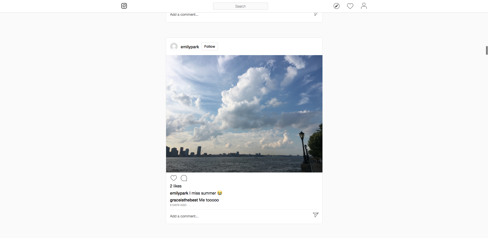

# README

Live: [Finstagram](https://finstagram-aa.herokuapp.com/#/ "Finstagram")

Finstagram is a fullstack single-page social media web application based on [Instagram](https://www.instagram.com/ "Instagram"). Users can sign up, share photos, and interact with photos other users posted.

Once logged in, users are taken to their feed of posts.

Development technologies include React/Redux for the frontend and Ruby on Rails/PostgreSQL for the backend.