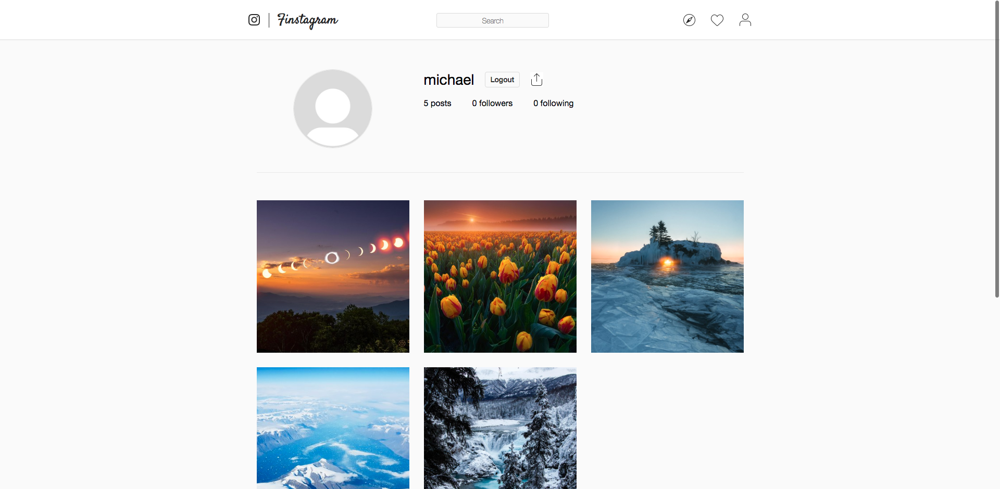

# README

Live: [Finstagram](https://finstagram-aa.herokuapp.com/#/ "Finstagram")

Finstagram is a fullstack single-page social media web application based on [Instagram](https://www.instagram.com/ "Instagram"). Users can sign up, share photos, and interact with photos other users posted.

Finstagram's main feature is being able to share photos and see photos of other users. Once logged in, users are taken to their feed of posts. Users can create posts by clicking on the upload icon on the navigation bar, which immediately updates the feed. Users can navigate to their personal profile page by clicking on the profile icon on the navigation bar. From there, they may view all of their posts individually. 

Users can see their profile that lists their own posts.

Development technologies include React/Redux for the frontend and Ruby on Rails/PostgreSQL for the backend.