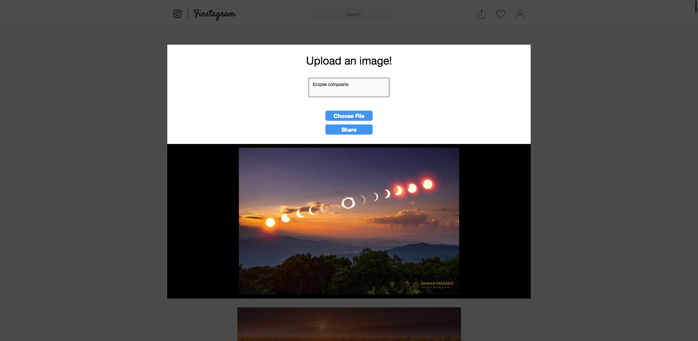

# README

## Live: [Finstagram](https://finstagram-aa.herokuapp.com/#/ "Finstagram")

Finstagram is a fullstack single-page social media web application based on [Instagram](https://www.instagram.com/ "Instagram"). Users can sign up, share photos, and interact with photos other users posted by liking and commenting.

# Feature highlights

## Feed

Finstagram's main feature is being able to share photos and see photos of other users. Once logged in, users are taken to their feed. Users can create posts by clicking on the upload icon on the navigation bar, which immediately updates the feed.

## Profile

Users can navigate to their personal profile by clicking on the profile icon on the navigation bar. From there, they may view all of their posts individually, create posts through the navigation bar, or navigate back to their feed by clicking on the logo icon at the top.

## Post Create

Clicking on the upload icon opens up a post form that includes an optional caption input and a mandatory photo input. Once a file is chosen, the photo is previewed on screen before submittion.

Development technologies include React/Redux for the frontend and Ruby on Rails/PostgreSQL for the backend.